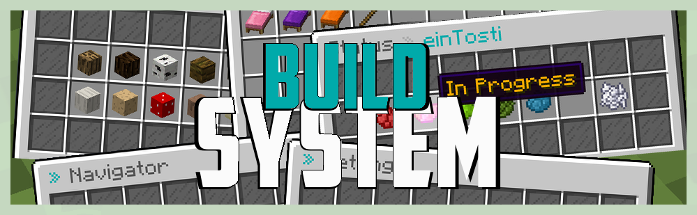

# BuildSystem   

## Introduction
**BuildSystem** is a simple but powerful - as the name already says - system for builders, with lots of great features for everyday usage.
Manage worlds in the worlds navigator, change their permission, projects and status with ease.
And not to forget: let each player decide which settings whey think are best for them and now the building can start!

## Full guide
You can find a full guide with tutorials, commands and permissions [here](https://eintosti.gitbook.io/buildsystem/).

## Contributing

### Compilation
Build with `mvn clean install`.

### PR Policy
I'll accept changes that make sense. You should be able to justify their existence, along with any maintenance costs that come with them.

## License
This project is licensed under the [BSD 4-Clause License](LICENSE).
