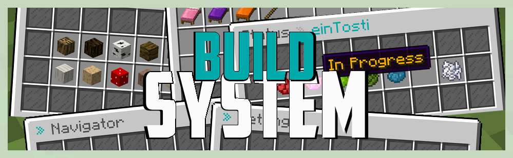

# BuildSystem   [](https://discord.gg/rduPF3yk62)

## Table of contents

* [Introduction](#introduction)
* [Links and Contacts](#links-and-contacts)
* [Features](#features)
* [Statistics](#statistics)
* [Developer API](#developer-api)
* [Contributing](#contributing)
    * [To compile...](#to-compile)
    * [Then you will find...](#then-you-will-find)
    * [Other commands](#other-commands)
    * [PR Policy](#pr-policy)
* [License](#license)

## Introduction

**BuildSystem** is a simple but powerful world management plugin made for builders, packed with
features for everyday use. Manage all your worlds from a single navigator, set each one's permission,
project and status with ease, and let every player choose the settings that suit them best.
Everything builders need is here, so you can get straight to building.

## Links and Contacts

* **Full guide:**
  You can find a full guide with tutorials, commands and
  permissions [here](https://eintosti.gitbook.io/buildsystem/).
* **Downloads:**
    * [SpigotMC](https://spigotmc.org/resources/60441/)
    * [Chunkfactory](https://chunkfactory.com/product/1049/)
    * [BuiltByBit](https://builtbybit.com/resources/12399/)
    * Snapshots are available on [Jenkins](https://ci.eintosti.de/job/BuildSystem/).
* **Support:**
    * [GitHub issue tracker](https://github.com/thomasmny/BuildSystem/issues)
    * [Discord](https://discord.gg/rduPF3yk62)
* **Donations:**
  Donations are **100%** voluntary. However, I am truly grateful for every single one of you who
  decides to do so as
  each donation helps me to continue developing the project further. If you wish to donate anything,
  you can do
  so [here](https://einTosti.com/donate).

## Features

### World management

* Create worlds from predefined types, from custom generators provided by other plugins, or from
  your own templates
* Import worlds individually or all at once, and delete, rename or clone them with ease
* Protect your builds with automatic and manual backups, stored locally or on S3 or SFTP and
  restored from an in-game menu
* Assign multiple builders to a world, and optionally keep WorldEdit limited to them
* Automatically unload inactive worlds to save server resources
* Configure every world individually: join permission, project, difficulty, gamerules, world border,
  spawn, weather, block physics, explosions and mob AI
* Give each world its own item to tell them apart at a glance

### Navigator

* Browse your worlds through an interactive navigator, or switch to a classic GUI
* Worlds are organised into categories, Public, Archive and Private out of the box, grouped by who
  can see them and their current state
* Track progress with per-world statuses: Not Started, In Progress, Almost Finished, Finished, plus
  Archive and Hidden
* Rename, recolour, reorder or remove any status or category in-game, each with its own icon
* Organise worlds into folders, with full sorting and filtering

### Build mode

* In finished worlds players become invisible and fly in adventure mode, so they can explore without
  changing anything (use `/build` to bypass)
* Players keep their items on death, and archived worlds behave exactly how you configure them

### Player settings & building tools

* Per-player settings including the scoreboard, night vision, no-clip, hiding other players, slab
  breaking, opening iron doors and trapdoors, instant sign placement and more
* A full set of building tools: adjustable fly and walk speed, block physics toggle, world time
  control, player skulls, mob AI and explosion toggles, a secret blocks menu, gamemode switching,
  and quick teleports with `/back`, `/top` and `/spawn`

### Customization & integrations

* **100% customisable** messages and scoreboard
* Built to work alongside LuckPerms, PlaceholderAPI, WorldEdit and AxiomPaper
* A developer API with events, so you can build your own integrations on top (see
  [below](#developer-api))

## Statistics


## Developer API


**Maven:**

```xml

<dependency>
    <groupId>de.eintosti</groupId>
    <artifactId>buildsystem-api</artifactId>
    <version>version</version>
</dependency>
 ```

**Or alternatively, with Gradle:**

```kotlin
repositories {
    mavenCentral()
}

dependencies {
    compileOnly("de.eintosti:buildsystem-api:version")
}
```

Full reference documentation is published
at [javadoc.io](https://javadoc.io/doc/de.eintosti/buildsystem-api).

### Usage

Obtain the API instance through Bukkit's `ServicesManager`:

```java
BuildSystem api = getServer().getServicesManager()
        .getRegistration(BuildSystem.class)
        .getProvider();
```

Alternatively, use the static shorthand `BuildSystemProvider.get()`.

The main entry points are `WorldService` (creating, importing and looking up worlds) and `PlayerService`
(per-player settings). Unless a method's documentation states otherwise, all API calls must be made from the server
main thread; methods that perform I/O return a `CompletableFuture` and document which thread it completes on.

## Contributing

Build requires **Java 25**.

### To compile...

#### On Windows

1. Shift + right-click the folder with the directory’s files and click "Open command prompt".
2. `gradlew clean build`

#### On Linux, BSD, or Mac OS X

1. In your terminal, navigate to the folder with directory’s files (cd /folder/of/buildsystem/files)
2. `./gradlew clean build`

### Then you will find...

* the **BuildSystem** plugin jar `BuildSystem-<version>` in **build/libs** (the repo root)

### Other commands

* `./gradlew runServer` will download a Paper server and start it with the freshly-built plugin for
  local testing.
* `./gradlew idea` will generate an [IntelliJ IDEA](https://www.jetbrains.com/idea/) module for each
  folder.

### PR Policy

I'll accept changes that make sense. You should be able to justify their existence, along with any
maintenance costs
that come with them.

## License

This project is licensed under the [GNU General Public License v3.0](LICENSE.txt).
