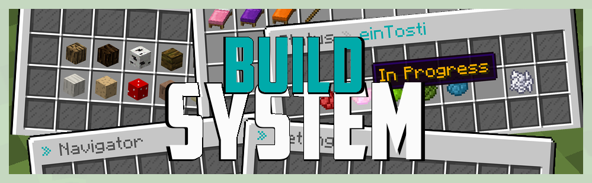

# BuildSystem   [](https://discord.gg/rduPF3yk62)

## Table of contents

* [Introduction](#introduction)
* [Requirements](#requirements)
* [Links and Contacts](#links-and-contacts)
* [Features](#features)
* [Statistics](#statistics)
* [Developer API](#developer-api)
* [Contributing](#contributing)
    * [To compile...](#to-compile)
    * [Then you will find...](#then-you-will-find)
    * [Other commands](#other-commands)
    * [PR Policy](#pr-policy)
* [License](#license)

## Introduction

**BuildSystem** is a world management plugin for builders. A single navigator lists every world on
the server, each with its own permission, project and status. Players choose the settings they
prefer, and admins set up statuses, categories and icons in-game rather than in a config file.

## Requirements

* **Minecraft 26.1 or newer**, on Paper or Spigot
* **Java 25**

Optional integrations: LuckPerms, PlaceholderAPI, WorldEdit, AxiomPaper.

## Links and Contacts

* **Full guide:**
  You can find a full guide with tutorials, commands and
  permissions [here](https://eintosti.gitbook.io/buildsystem/).
* **Downloads:**
    * [SpigotMC](https://spigotmc.org/resources/60441/)
    * [Chunkfactory](https://chunkfactory.com/product/1049/)
    * [BuiltByBit](https://builtbybit.com/resources/12399/)
    * Snapshots are available on [Jenkins](https://ci.eintosti.de/job/BuildSystem/).
* **Support:**
    * [GitHub issue tracker](https://github.com/thomasmny/BuildSystem/issues)
    * [Discord](https://discord.gg/rduPF3yk62)
* **Donations:**
  Donations are **100%** voluntary. However, I am truly grateful for every single one of you who
  decides to do so as
  each donation helps me to continue developing the project further. If you wish to donate anything,
  you can do
  so [here](https://einTosti.com/donate).

## Features

### World management

* Create worlds from predefined types, from custom generators provided by other plugins, or from
  your own templates, optionally with a custom seed
* Import worlds individually or all at once, then rename, clone or delete them
* Automatic and manual backups, kept locally or on S3 or SFTP, and restored from an in-game menu
* Assign multiple builders to a world, and optionally keep WorldEdit limited to them
* Automatically unload inactive worlds to save server resources
* Configure every world individually: join permission, project, difficulty, gamerules, world border,
  spawn, weather, explosions and mob AI
* Disable block physics per world without freezing it entirely: nine behaviours (block updates,
  connections, falling blocks, fluid flow, leaf decay, growth, spreading, block forming and fading)
  can each be re-allowed while the rest stay off
* Choose the block placed at a void world's spawn, or turn it off
* Give each world its own icon, either a block or a player head, so they are easy to tell apart

### Navigator

* Browse worlds through an interactive navigator, or switch to a plain GUI
* Categories group worlds by who can see them and what state they are in. Public, Archive and
  Private are set up for you, and you can add your own
* Per-world statuses track progress: Not Started, In Progress, Almost Finished, Finished, Archive
  and Hidden
* Rename, recolour, reorder or delete any status or category in-game, each with its own icon
* Sort and filter worlds, and group them into folders
* Pin a world to keep it at the top of every list

### Build mode

* In finished worlds players turn invisible and fly in adventure mode, so they can look around
  without changing anything. `/build` bypasses this
* Players keep their items on death, and archived worlds behave however you configure them

### Player settings & building tools

* Per-player settings: scoreboard, night vision, no-clip, hiding other players, slab breaking,
  opening iron doors and trapdoors, instant sign placement, and more
* Building tools: adjustable fly and walk speed, block physics and explosion toggles, world time
  control, mob AI, player skulls, a secret blocks menu, gamemode switching, and quick teleports with
  `/back`, `/top` and `/spawn`

### Customisation & integrations

* `/setup` configures default world-type icons, statuses and the navigator layout in-game, using a
  drag-and-drop editor with colour and item pickers
* Every message and the scoreboard can be rewritten
* Works alongside LuckPerms, PlaceholderAPI, WorldEdit and AxiomPaper
* A developer API with events for your own integrations, described [below](#developer-api)

## Statistics


## Developer API


**Maven:**

```xml

<dependency>
    <groupId>de.eintosti</groupId>
    <artifactId>buildsystem-api</artifactId>
    <version>version</version>
</dependency>
 ```

**Or alternatively, with Gradle:**

```kotlin
repositories {
    mavenCentral()
}

dependencies {
    compileOnly("de.eintosti:buildsystem-api:version")
}
```

Full reference documentation is published
at [javadoc.io](https://javadoc.io/doc/de.eintosti/buildsystem-api).

### Usage

Obtain the API instance through Bukkit's `ServicesManager`:

```java
BuildSystem api = getServer().getServicesManager()
        .getRegistration(BuildSystem.class)
        .getProvider();
```

Alternatively, use the static shorthand `BuildSystemProvider.get()`.

`WorldService` handles worlds, `PlayerService` per-player settings, and separate registries hold the
statuses and navigator categories. Calls belong on the server main thread unless documented otherwise;
anything doing I/O returns a `CompletableFuture` and says which thread it completes on.

## Contributing

Build requires **Java 25**.

### To compile...

#### On Windows

1. Shift + right-click the project folder and choose "Open command prompt".
2. `gradlew clean build`

#### On Linux, BSD, or Mac OS X

1. In a terminal, `cd` into the project folder.
2. `./gradlew clean build`

### Then you will find...

* the plugin jar `BuildSystem-<version>.jar` in **build/libs** at the repo root

### Other commands

* `./gradlew runServer` downloads a Paper server and starts it with the plugin you just built.
* `./gradlew idea` will generate an [IntelliJ IDEA](https://www.jetbrains.com/idea/) module for each
  folder.

### PR Policy

I'll accept changes that make sense. You should be able to justify their existence, along with any
maintenance costs
that come with them.

## License

This project is licensed under the [GNU General Public License v3.0](LICENSE.txt).
